End Goal:
1. Bikin enemy yang ngikutin player
2. Buat health system yang bisa diimplement dengan sesimpel tapi masih ada elemen modularnya
3. Gunain event systemnya unity

Tutor

1. import sprite enemy ke `Assets/Sprites/Enemy/`
2. di inspector, ubah `Pixel Per Ponit` menjadi sama dengan sprite Player (klo disini `16`), filter mode jadi `Point (no filter)`, compression jadi `None`

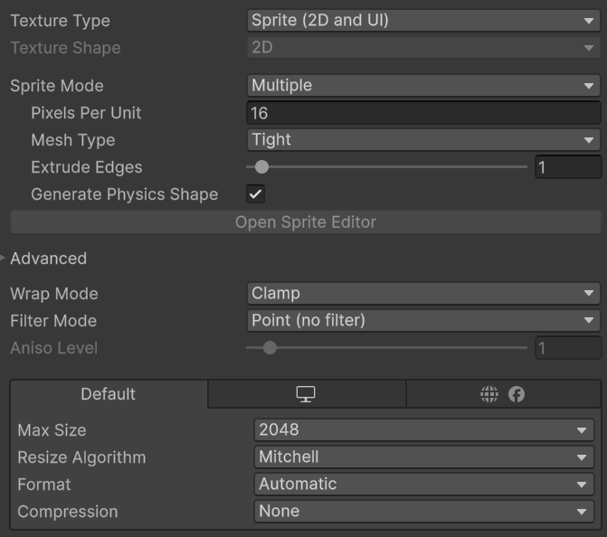

4. Buat setiap sprite, buka Sprite Editor trus pilih Slice lalu pilih typenya `Grid By Cell Size`, cell sizenya `24x24`, pivot `bottom`, lalu klik `Slice` trus `apply`

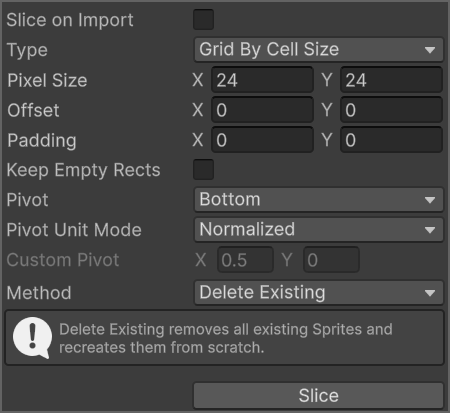 

6. Buat animation dengan cara drag aja spritenya ke scene. Trus nanti save di `Animations/Enemy` sesuai nama animasinya. Trus buat animasi `Die` dan `DieBack` loop timenya false

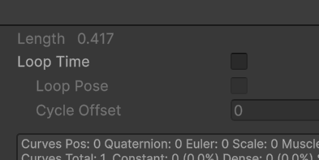

8. Hapus `Animation Controller` dan `Game Object` yang dibuat automatis

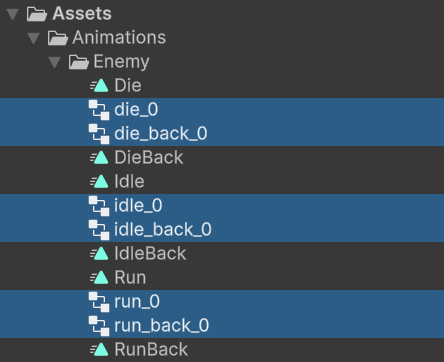

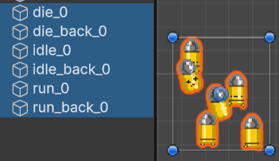

9. Bikin juga buat animasi tambahan `Player`
10. Bikin `Animation Controller` dengan nama `Enemy` terus buka animatornya dan drag semua animasi yang udah kita buat. Pastiin animasi Idle jadi defaultnya (warna kuning)

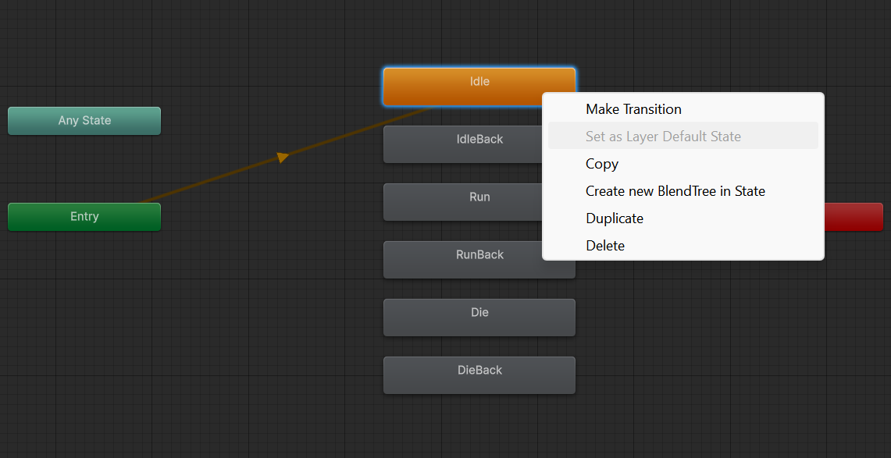

11. Tambahin parameter baru buat animasi
   - Bool `IsMoving`
   - Float `DirY`
   - Bool `IsDead`
11. Buat transisi untuk setiap animasi (sesuai logika aja, gunain parameter yang udah dibuat tadi). Setiap transisi buat `Has Exit Time` jadi false, `Transition Duration` jadi 0, dan sesuain `Conditions`-nya (misalnya klo dari `Idle` ke `Die` berarti kondisinya `IsDead = true`)

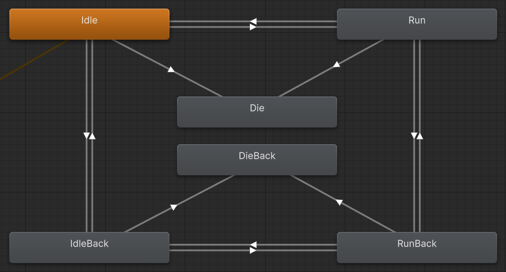

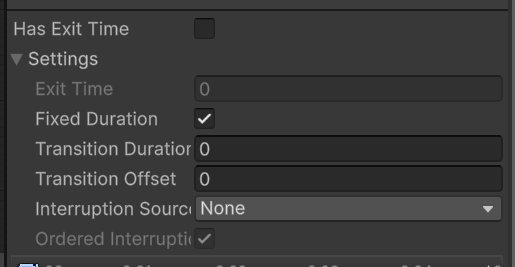

12.  Update juga `Animation Controller`-nya `Player` dengan nambahin parameter `IsDead` dan tambahin animasi `Die` dan `DieBack`. Buat kayak gini juga

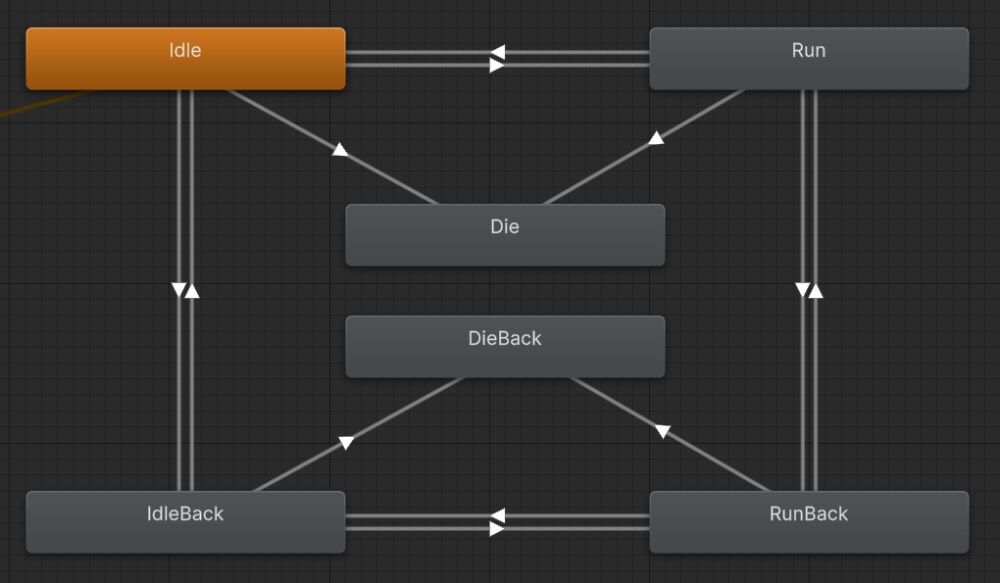

13.  Buat `GameObject` baru dengan nama "Enemy". Tambahin komponen `Sprite Renderer`, `Animator`, `Rigidbody 2D`, `Box Collider 2D`, `EnemyController`, dan `Health`
```cs
using UnityEngine;

public class EnemyController : MonoBehaviour
{
    public float moveSpeed = 2f;
    public float chaseRange = 6f;
    public float stopRange = 1f;
    public float detectionDelay = 0.2f;
    public float damage = 25f;
    public float damageCooldown = 0.1f;
    public float damageTimer = 0f;

    private Rigidbody2D rb;
    private Animator animator;
    private SpriteRenderer spriteRenderer;
    private Transform player;

    private Vector2 moveDir;
    private bool isDead = false;
    private float checkTimer;

    void Start()
    {
        rb = GetComponent<Rigidbody2D>();
        animator = GetComponent<Animator>();
        spriteRenderer = GetComponent<SpriteRenderer>();
    }

    void Update()
    {
        player = GameObject.FindGameObjectWithTag("Player")?.transform;
    }

    void FixedUpdate()
    {
        damageTimer -= Time.fixedDeltaTime;

        if (isDead || player == null)
        {
            rb.linearVelocity = Vector2.zero;
            return;
        }

        checkTimer -= Time.fixedDeltaTime;
        if (checkTimer <= 0f)
        {
            checkTimer = detectionDelay;
            UpdateMovement();
        }

        rb.linearVelocity = moveDir * moveSpeed;
        UpdateAnimator();
    }

    private void UpdateMovement()
    {
        Vector2 dir = (player.position - transform.position);
        float dist = dir.magnitude;

        if (dist <= chaseRange && dist > stopRange)
        {
            moveDir = dir.normalized;
        }
        else moveDir = Vector2.zero;
    }

    private void UpdateAnimator()
    {
        bool isMoving = moveDir.sqrMagnitude > 0.01f;
        animator.SetBool("IsMoving", isMoving);

        animator.SetFloat("DirY", moveDir.y);
        spriteRenderer.flipX = moveDir.x < 0;
    }

    public void Die()
    {
        if (isDead) return;
        isDead = true;
        animator.SetBool("IsDead", true);
        rb.linearVelocity = Vector2.zero;
        GetComponent<Collider2D>().enabled = false;
        Destroy(gameObject, 0.2f);
    }

    private void OnTriggerStay2D(Collider2D other)
    {
        if (isDead) return;
        if (damageTimer > 0) return;

        Health health = other.GetComponent<Health>();

        if (other.CompareTag("Player") && health != null)
        {
            health.TakeDamage(damage);
            damageTimer = damageCooldown;
            Debug.Log("damaged");
        }
    }
}
```

```cs
using UnityEngine;
using UnityEngine.Events;

public class Health : MonoBehaviour
{
    public float maxHealth = 100f;
    private float currentHealth;
    private bool isDead;

    public UnityEvent onDeath;
    public UnityEvent<float> onHealthChanged;

    void Awake()
    {
        currentHealth = maxHealth;
    }

    public void TakeDamage(float damage)
    {
        if (isDead) return;

        currentHealth -= damage;
        onHealthChanged?.Invoke(currentHealth);

        if (currentHealth <= 0) Die();
    }

    private void Die()
    {
        isDead = true;
        onDeath?.Invoke();
    }
}
```
12. Set `Sprite` di `Sprite Renderer` jadi `idle_0`-nya Enemy (keknya ga perlu sih tapi). Trus set `Controller` di `Animator` jadi `Enemy`

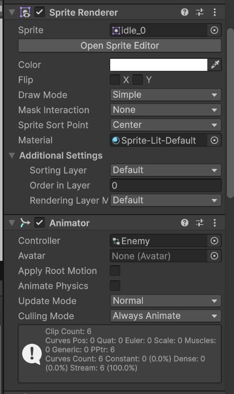

13. Sesuain `Box Collider` (sesuai sprite aja tapi bagian kaki doang (klo gue offset x=0 y=0.15 dan size x=0.75 y=0.3)), `Enemy Controller` (sesuaiin speednya klo mau), `Health` (sesuaiin max healthnya)
14. Tambahin event handlernya `On Death`. trus masukin objectnya `Enemy Controller` (drag aja enemy controller di inspector trus drop di bagian objectnya) trus cari fungsi `die()`

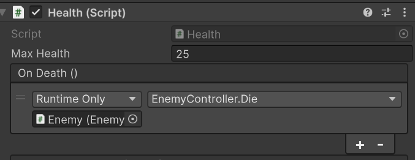

15. Trus tambahin lagi `Game Object` sebagai child dari enemy namain `DamageArea` trus tambahin `Box Collider 2D` sesuaiin areanya trus centang `Is Trigger`

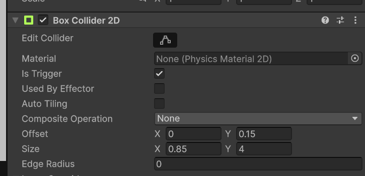

16. ganti `Projectile.cs` jadi kayak gini
```cs
using UnityEngine;

public class Projectile : MonoBehaviour
{
    public float speed = 20f;
    public float lifeTime = 2f;
    public float damage = 25f;

    private Rigidbody2D rb;

    void Awake()
    {
        rb = GetComponent<Rigidbody2D>();
    }

    void Start()
    {
        Destroy(gameObject, lifeTime);
    }

    public void Fire(Vector2 direction)
    {
        rb.linearVelocity = direction.normalized * speed;
    }

    private void OnCollisionEnter2D(Collision2D collision)
    {
        Health health = collision.gameObject.GetComponent<Health>();
        if (health != null)
        {
            health.TakeDamage(damage);
        }
        Destroy(gameObject);
    }
}
```
17. Sekarang Enemy udah bisa mati klo ditembak.
18. Tapi player blom bisa mati, jadi tambahin komponen Health ke `Player`. lakuin hal yang sama tinggal masukkin `PlayerController.cs`. Tapi kan blom ada fungsi `die()`, jadi bikin dulu abis itu baru set fungsinya.
```cs
using UnityEngine;
using UnityEngine.InputSystem;

public class PlayerController : MonoBehaviour
{
    public float moveSpeed = 5f;
    public float dashSpeed = 15f;
    public float dashDuration = 0.2f;
    public float dashCooldown = 0.5f;

    private Rigidbody2D rb;
    private Vector2 moveInput;
    private Vector2 dashInput;
    private bool isDashing = false;
    private float dashTime;
    private float dashCooldownTime;

    private PlayerControls controls;
    private Animator animator;
    private SpriteRenderer spriteRenderer;

    public GameObject projectilePrefab;
    public Transform firePoint;
    public float fireCooldown = 0.2f;
    private float fireTimer;

    private bool isDead = false;

    private void Awake()
    {
        rb = GetComponent<Rigidbody2D>();
        animator = GetComponent<Animator>();
        spriteRenderer = GetComponent<SpriteRenderer>();
        controls = new PlayerControls();

        controls.Player.Move.performed += ctx => moveInput = ctx.ReadValue<Vector2>();
        controls.Player.Move.canceled += ctx => moveInput = Vector2.zero;

        controls.Player.Dash.performed += ctx => TryDash();

        controls.Player.Attack.performed += ctx => TryAttack();
    }

    private void OnEnable() => controls.Player.Enable();
    private void OnDisable() => controls.Player.Disable();

    private void FixedUpdate()
    {
        if (isDead)
        {
            rb.linearVelocity = Vector2.zero;
            return;
        }
        if (isDashing)
        {
            rb.linearVelocity = dashInput.normalized * dashSpeed;
        }
        else
        {
            rb.linearVelocity = moveInput * moveSpeed;
            if (moveInput.sqrMagnitude > 0.01f)
            {
                dashInput = moveInput;
            }
        }

        if (isDashing && Time.time > dashTime)
        {
            isDashing = false;
        }

        UpdateAnimator();

        fireTimer -= Time.fixedDeltaTime;
    }

    private void TryDash()
    {
        if (isDead) return;
        if (!isDashing && Time.time > dashCooldownTime && dashInput != Vector2.zero)
        {
            isDashing = true;
            dashTime = Time.time + dashDuration;
            dashCooldownTime = Time.time + dashCooldown;
        }
    }
    private void TryAttack()
    {
        if (isDead) return;
        if (fireTimer > 0) return;

        Vector3 mouseWorld = Camera.main.ScreenToWorldPoint(Mouse.current.position.ReadValue());
        Vector2 mouseDir = mouseWorld - transform.position;

        GameObject projectile = Instantiate(projectilePrefab, firePoint.position, Quaternion.identity);
        projectile.GetComponent<Projectile>().Fire(mouseDir);

        fireTimer = fireCooldown;
    }

    private void UpdateAnimator()
    {
        bool isMoving = moveInput.sqrMagnitude > 0.01f;
        animator.SetBool("IsMoving", isMoving);

        Vector3 mouseWorld = Camera.main.ScreenToWorldPoint(Mouse.current.position.ReadValue());
        Vector2 mouseDir = mouseWorld - transform.position;
        animator.SetFloat("MouseY", mouseDir.y);

        spriteRenderer.flipX = mouseDir.x < 0;
    }

    public void Die()
    {
        if (isDead) return;
        isDead = true;
        animator.SetBool("IsDead", true);
        rb.linearVelocity = Vector2.zero;
        GetComponent<Collider2D>().enabled = false;
    }
}
```
19. Coba mainin dulu. Seharusnya enemy udah bisa ngejar dan mati klo ditembak. player juga udah bisa mati dan kena damage klo nyentuh enemy. Kalo `Enemy` blom ngejar `Player`, pastiin `Player` udah punya tag `Player` 

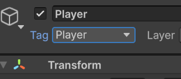

20. Nanti kan ceritanya object `Enemy` bakal mau di pake berkali kali ya, jadi buat menjadi prefab. caranya tiggal drag aja objectnya ke folder mana aja di window `Project` (tapi taro di folder `Prefabs` sih yang bener)

Catetan: emang blom ada feedback kalo kena damage dll sih, ntar aja dipolishnya wkwkwwk yang penting jadi dlu.
